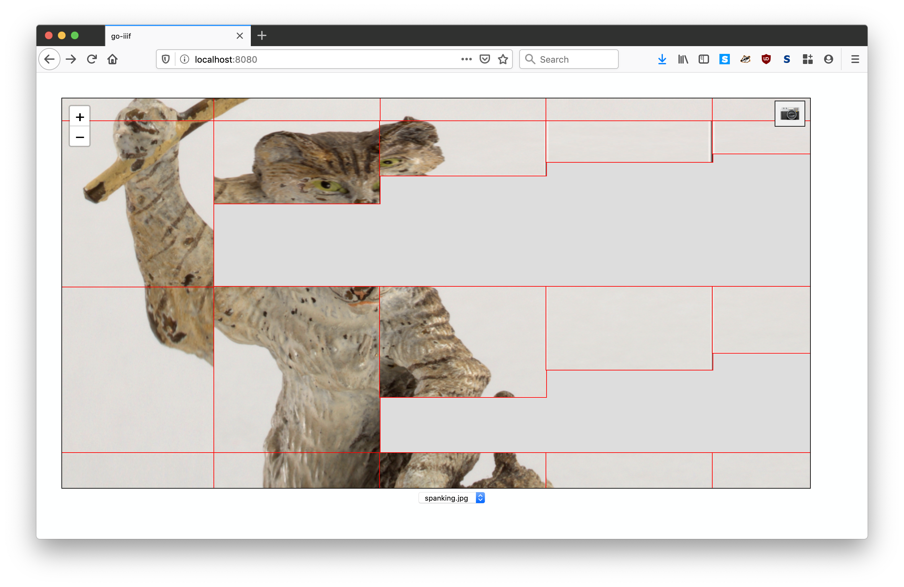

# go-iiif-www

A simple web application for testing go-iiif related tools.

## Important

This is work in progress. It is not properly documented yet. It is also, as of this writing, not a full-fledged application but rather a set of debuggings tool for testing the output the of the [go-iiif](https://github.com/go-iiif/go-iiif) and [go-iiif-vips](https://github.com/go-iiif/go-iiif-vips) tile-seeding. For example:



Clearly, something is wrong here. This is much better:


_Note that the red borders on the tiles are deliberate and set using CSS._

## Tools

### tiles-server

```
go run cmd/tile-server/main.go -tiles-root /path/to/go-iiif-vips/docker/cache/ -www-root ./www/
2019/10/29 12:46:06 listening on localhost:8080
```

## See also

* https://github.com/go-iiif/go-iiif
* https://github.com/go-iiif/go-iiif-vips